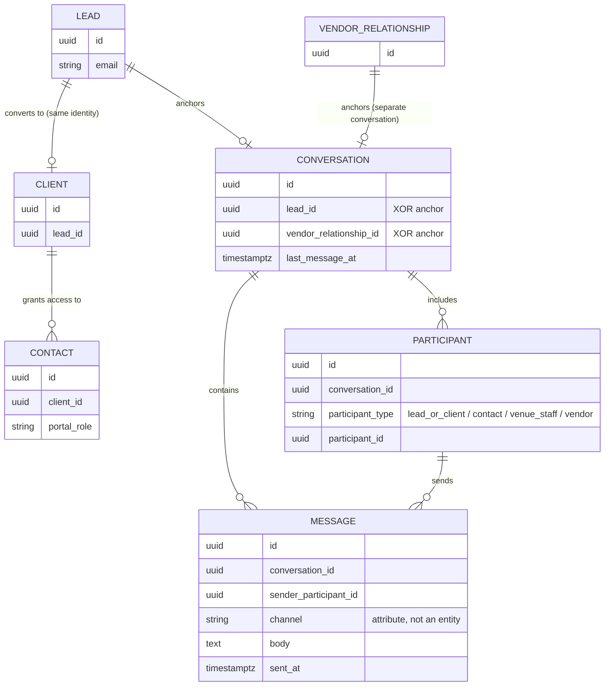
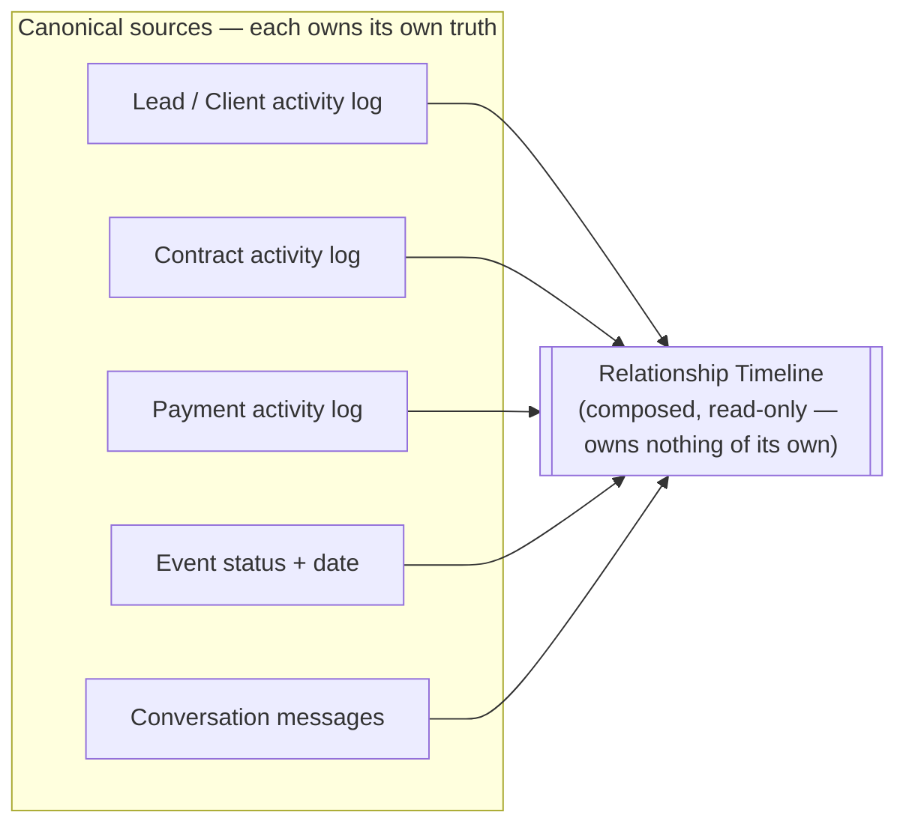
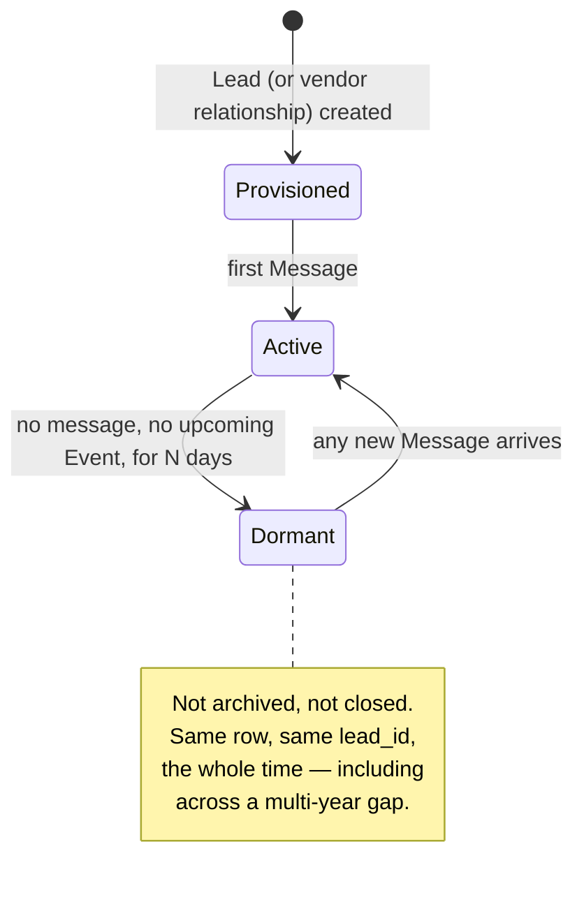
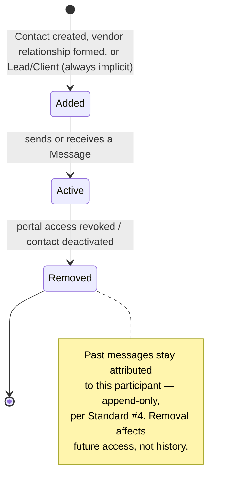
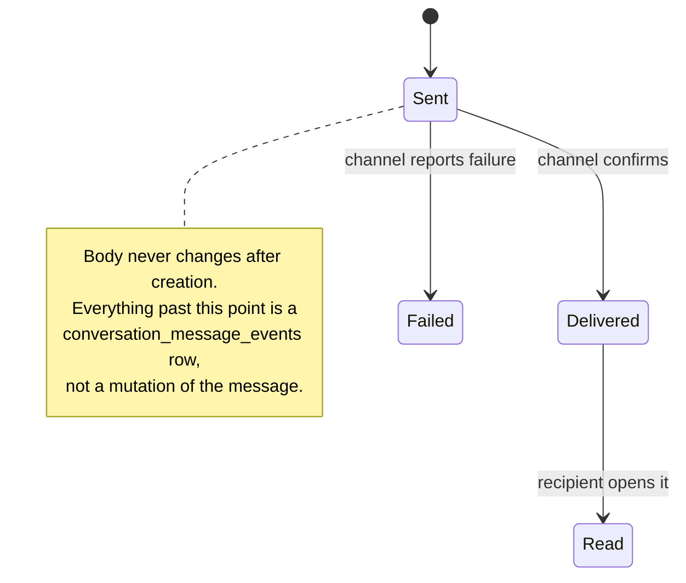

# Conversation Lifecycle Design

**Status:** Design proposal — not yet implemented. This is the lifecycle-first pass requested before Program 2 Phase 2 begins; it revises (and should be read as superseding) the schema sketch in `docs/program-2-implementation-plan.md`'s Phase 2 section, which was written transport-first. **§1 and §7.8 are further superseded by `docs/lead-identity-architectural-exploration.md`**, which concluded Conversation should anchor to a new enduring **Relationship** concept, not to Lead — confirmed and locked in; read that document for the reasoning, this one's anchor references have been updated to match.
**Relationship to other docs:** `docs/domain-model.md`'s Conversation entity is the concept this document goes deep on. `docs/contract-lifecycle-design.md` is the sibling document for Contract's lifecycle — same treatment, different entity. `docs/lead-identity-architectural-exploration.md` is where the anchor question below was reopened and resolved in favor of Relationship over Lead.

---

## The reframe

The instinct to avoid: designing "a thread that holds messages," then bolting a channel field onto each message. That produces a system whose natural unit is still the *message* — you'd still think in terms of "the email thread" or "the text conversation," just unified into one table. That's transport-first design wearing a Conversation-shaped costume.

The correct unit is the **relationship itself**. A venue doesn't have "an email thread with Emma & James that also happens to contain some texts" — it has *a relationship with Emma & James* that has, so far, involved an inquiry, a tour, some emails, a text about parking, a phone call the coordinator logged by hand, and will involve more of all of that before the wedding and after it. The Conversation is the durable record of that relationship's communication — not a container that happens to be long-lived.

This distinction has concrete design consequences, worked through below.

---

## 1. What a Conversation is anchored to

**A Conversation anchors to the enduring Relationship, not to an individual Lead, not to the Client identity, and not the Event.**

This corrects twice. The original Phase 2 sketch keyed `conversations.client_id`; the first pass of this document corrected that to `lead_id`. `docs/lead-identity-architectural-exploration.md` found that `lead_id` was still one level too low: Lead now represents one **Opportunity** (one specific ask, at one specific pipeline stage), and a customer relationship can have more than one Opportunity over time — a wedding, then an anniversary party; an annual corporate gala, rebooked every year. A Conversation anchored to a single Opportunity would need to fork, or be silently reattached, the moment a second Opportunity opened for the same customer — exactly the fragmentation this phase exists to prevent, just recreated one level up.

Reasoning for anchoring to Relationship specifically:

- Communication starts at first contact — before a Client record exists, often before there's even a confirmed event, and it continues across every future Opportunity the same customer ever brings, not just the first one.
- The enduring counterparty isn't always reducible to one person, either — a couple, a family, or a corporation whose point-of-contact turns over every year are all one Relationship, never one Lead and never one Person (`docs/lead-identity-architectural-exploration.md` §4).
- If Conversation anchored to a Lead/Opportunity, every message would need to be retroactively reattached each time a new Opportunity opened for a returning customer, or would fork into a disconnected second conversation. Anchoring to Relationship means the conversation is already correct and complete regardless of how many Opportunities come and go underneath it — nothing moves, nothing forks.
- This makes Phase 1's Lead deduplication work still a genuine prerequisite, just one layer removed: `find_lead_by_email`'s matching is exactly the logic the new Relationship-matching step needs, applied one level higher.

For a Vendor relationship, the anchor stays the existing vendor relationship record (`venue_vendor_relationships`) — the customer-side Relationship concept is the deliberate mirror of this, per the exploration's naming precedent.

**Schema implication:** `conversations.relationship_id` (references the new `venue_customer_relationships`), with `vendor_relationship_id` as the alternate anchor for vendor conversations — exactly one of the two is set. `leads.relationship_id` links each Opportunity back to its Relationship.

## 2. Does a Conversation have a lifecycle of its own, or does it inherit one?

**It inherits one. A Conversation has no independent status field.**

A support-ticket model would give Conversation its own states — open, resolved, closed, reopened. That's wrong here, because a venue relationship doesn't resolve and close the way a support ticket does. Emma & James' conversation doesn't "close" after their wedding — it goes quiet, and it's exactly as valid to see three years later when they email asking about hosting their anniversary party, or when their friend mentions "Emma said you were great" and a coordinator wants the context.

Concretely: no `status` column. What a UI needs — "is this relationship currently active," "does this need attention" — is *computed*, the same way Calendar Entry was established in Phase 1 as a projection with no owned state:

- **Active** — an open Lead/Client relationship with recent activity or an upcoming Event.
- **Dormant** — no recent activity, no upcoming Event, but the relationship (Lead/Client record) still exists. Not archived. Not closed. Just quiet.
- **Needs attention** — an unanswered inbound message past some threshold, regardless of overall dormancy.

All three are read-time labels derived from `last_message_at`, the linked Lead/Client's own status, and Event dates — never a state a coordinator manually sets on the Conversation itself. This is a direct application of Engineering Standard #7's lesson generalized: don't give a projection its own writable state, or it will eventually disagree with the thing it's supposed to reflect.

## 3. Multiple people, one Conversation

Emma, James, Emma's mother, and the day-of planner might all message the venue. That's **one Conversation with four Participants**, not four conversations.

`conversation_participants` records who can appear in and contribute to the conversation — a venue Team Member, the primary Lead/Client, a Contact (per the existing `client_contacts` model, itself already scoped with a `portal_role`), or a Vendor user. Every message is attributed to whichever participant sent it (`sender_type` + `sender_id`), but attribution is a property of the message, not a fork in the conversation. "I'm looking at Emma & James' conversation" stays true regardless of which of the four people said the most recent thing in it.

This also means Contact-level `portal_role` restrictions (TR-G4) extend naturally here: a Contact scoped to `view_only` can see the conversation but not send into it; one scoped to `financial` might not see the conversation at all, depending on how conversation visibility is scoped per role — a decision for the access model in Phase 2's implementation, not this document, but worth flagging now so it isn't retrofitted later the way TR-G4 had to be.

## 4. Messages vs. relationship milestones — related, not merged

The instinct to resist here: since the goal is "the whole story of the relationship in one place," it's tempting to fold `lead_activities`/status-change history into the Conversation itself. Don't — that conflates two different entities the Domain Model already separates deliberately (Conversation vs. the activity/audit trail behind Lead, Contract, Payment, etc.).

Instead: a **Relationship Timeline** view *composes* Conversation messages and the relevant Lead/Client/Contract/Payment activity log entries, read-only, sorted chronologically — the same pattern Calendar uses to compose Events/Tours/Payments-due without owning any of them. A coordinator gets "everything that happened with Emma & James, in order" as a *view*, without Conversation's own schema needing to know about contracts, payments, or lead status changes. This keeps Conversation's actual responsibility narrow (communication) while still delivering the "one relationship, one story" experience the venue owner is asking for.

## 5. Continuity across multiple events, referrals, and re-engagement

If Emma & James book their wedding, then years later come back for a vow renewal, or refer their sister (a distinct person, a new Lead) — the anchor-to-Lead-identity design handles both correctly without special-casing:

- Emma & James returning: same Lead identity (or the Client record traced back to it), same Conversation, picks up exactly where it left off. No "reopening" step, because it was never closed.
- The sister: a new, distinct Lead (Phase 1's dedup logic wouldn't and shouldn't merge her with Emma & James — different person, different email), a new Conversation. The *referral relationship* between the two conversations is a fact worth capturing eventually (perhaps as a lightweight reference on the new Lead, `referred_by_lead_id`), but that's Lead-model scope, not something Conversation needs to represent directly.

## 6. What "creating" a Conversation actually means

Given Conversation has no independent lifecycle and anchors to an identity that's created at first contact, a Conversation row should be **provisioned automatically the moment a Lead (or vendor relationship) exists** — not explicitly created by a coordinator clicking "start a conversation," and not lazily created on first message. In practice: a database trigger or the same `find_or_create_lead()`-style path from Phase 1 ensures a Conversation row exists alongside every Lead. This means "does a conversation exist for this person" is never a question the system has to answer — it always does, the same way a Lead's activity log always exists once the Lead does, even if it's empty.

---

## Revised schema sketch

```sql
create table conversations (
  id                  uuid primary key default gen_random_uuid(),
  venue_id            uuid not null references venues(id),
  relationship_id     uuid references venue_customer_relationships(id),
  vendor_relationship_id uuid references venue_vendor_relationships(id),
  last_message_at     timestamptz,
  venue_unread        int not null default 0,
  contact_unread      int not null default 0,
  created_at          timestamptz not null default now(),
  constraint conversations_one_anchor check (
    (relationship_id is not null)::int + (vendor_relationship_id is not null)::int = 1
  )
);
-- One conversation per customer Relationship / per vendor relationship — not per Lead/Opportunity, not per Client, not per Event.
create unique index conversations_relationship_uniq on conversations(relationship_id) where relationship_id is not null;
create unique index conversations_vendor_uniq on conversations(vendor_relationship_id) where vendor_relationship_id is not null;

create table conversation_participants (
  id              uuid primary key default gen_random_uuid(),
  conversation_id uuid not null references conversations(id) on delete cascade,
  participant_type text not null check (participant_type in ('venue_staff','lead_or_client','contact','vendor')),
  participant_id   uuid not null, -- venue_staff.id / clients.id / client_contacts.id / vendor_users.id, per participant_type
  created_at      timestamptz not null default now()
);

create table conversation_messages (
  id              uuid primary key default gen_random_uuid(),
  conversation_id uuid not null references conversations(id) on delete cascade,
  sender_type     text not null check (sender_type in ('venue_staff','lead_or_client','contact','vendor','system')),
  sender_id       uuid,
  channel         text not null check (channel in ('email','sms','portal','internal_note','phone_log','voicemail','push')),
  body            text not null,
  body_html       text,
  channel_metadata jsonb not null default '{}',
  sent_at         timestamptz not null default now(),
  venue_read_at   timestamptz,
  contact_read_at timestamptz
);

create table conversation_message_events (
  id           uuid primary key default gen_random_uuid(),
  message_id   uuid not null references conversation_messages(id) on delete cascade,
  event_type   text not null, -- delivered, bounced, opened, clicked, failed
  occurred_at  timestamptz not null default now(),
  payload      jsonb
);
```

No `status` column on `conversations`. No per-conversation "close/reopen" action anywhere in the service layer. `last_message_at`/unread counts remain as denormalized convenience fields (maintained by trigger, same pattern as today's `couple_threads`), not lifecycle state.

## What this changes from the original Phase 2 sketch

- **Anchor:** `relationship_id` (references `venue_customer_relationships`), not `client_id`, not `lead_id` — the enduring counterparty that exists from first contact, persists through conversion, and outlives any single Opportunity (a wedding, then an anniversary party; an annual corporate rebooking), per `docs/lead-identity-architectural-exploration.md`.
- **No `status` field** — activity/dormancy is computed, not stored, matching the Calendar Entry projection principle.
- **Provisioning:** a Conversation exists automatically alongside its Relationship (created the first time a customer is identified, before their first Lead/Opportunity necessarily exists) or vendor relationship — not created explicitly or lazily on first message.
- **Scope stays narrow:** Conversation is communication only. The "whole relationship story" experience is delivered by a composed Relationship Timeline view, not by merging Lead activity/audit history into Conversation's own schema.

Everything else from the original sketch (Participants, Messages, channel-as-a-property-not-a-table, no attachments this phase, migration strategy, order of implementation, risks, Trust Risks closed) still holds and should be read alongside this document.

---

## 7. Stress-testing the model: diagrams and a full narrative walkthrough

Everything above was reasoned from first principles. This section verifies it against a concrete, continuous story before any table gets built — the specific request was to check that *one* conceptual model survives first inquiry through a two-years-later re-engagement without forking, without a migration, and without a special case.

### 7.1 Relationship diagram



Two things this diagram is deliberately *not* showing, because they'd misrepresent the model:

- **No `CHANNEL` box.** Channel is a column on Message, not a related entity — there's nothing else in the system that would ever join to "Channel" (no channel-level settings, permissions, or lifecycle). Drawing it as a box would imply it needs one.
- **No `EVENT` or `ACTIVITY` box connected to `CONVERSATION`.** Those stay owned by Lead/Client/Contract/Payment. The Activity Timeline (below) reads them; Conversation doesn't reference them.

### 7.2 Where Activity Timeline actually sits



Activity Timeline has no lifecycle diagram in this document because it has no lifecycle — it's a query, re-run fresh on every read, exactly like a Calendar Entry. There's nothing to draw a state machine for.

### 7.3 Conversation lifecycle



### 7.4 Participant lifecycle



### 7.5 Message lifecycle



### 7.6 The narrative walkthrough

Each step names what's created or touched. Nothing here required a new table, a forked conversation, or a status flip that isn't already computed.

| # | Scenario | What happens |
|---|---|---|
| 1 | **First inquiry** | Website form → `find_or_create_lead` creates Emma's Lead. A Conversation is provisioned automatically, anchored to that `lead_id`. Emma is an implicit Participant. Her form text becomes a Message (`sender_type='lead_or_client'`, `channel='portal'`). The system also logs a Lead Activity ("inquiry received") — a separate fact, not the same row as the Message, composed together later on the Relationship Timeline. |
| 2 | **Coordinator replies** | Message, `channel='email'`, same conversation. Proves a channel switch doesn't require a new thread or a new conversation. |
| 3 | **James emails in from his own address** | His email doesn't match any known Participant yet. It's still appended to the same conversation, attributed to "unknown sender (james@…)" rather than silently dropped or mis-attributed to Emma — matching the existing inbound-matching approach, just generalized from Lead-matching to Participant-matching. A coordinator later confirms James as a person on the account; from that point his email auto-attributes. This is the concrete case for **multiple participants emerging organically**, not provisioned in advance. |
| 4 | **Lead → Client conversion** | `clients` row created, `lead_id` points back to Emma's Lead. Conversation is untouched — same `lead_id`, same row. A Lead/Client Activity ("converted to client") is logged and shows on the composed timeline next to the existing messages. Nothing about the conversation needed to know conversion happened. |
| 5 | **Planner (Contact) added** | A `client_contacts` row for Sarah, `portal_role='planning'`. A new Participant row in the **same** conversation — she's acting inside the couple's own relationship, so she joins it rather than getting one of her own. |
| 6 | **Vendor (florist) added to the event** | `event_vendor_assignments` links Bloom & Co to the wedding. This is a **separate relationship with the venue** — a Conversation anchored to Bloom & Co's `vendor_relationship_id` is provisioned (new, or reused if they've worked together before). The florist is **not** added as a Participant in Emma & James' conversation. This is the one place the narrative could have tempted a shortcut ("just add the vendor to the couple's thread") — the model resists it, matching the `lead_id` XOR `vendor_relationship_id` constraint. |
| 7 | **Phone call** | Message, `channel='phone_log'`, body is the coordinator's typed summary. No separate "Interaction" entity was needed — a phone call is a Message like any other, just on a channel with no recipient-typed content. |
| 8 | **SMS** | Message, `channel='sms'`, channel-specific fields (provider message SID, etc.) live in `channel_metadata` jsonb. Adding this channel later is a code change (a new value in the channel check + a webhook handler), not a schema change — the table shape was already ready for it. |
| 9 | **Portal message** | Message, `channel='portal'`, sent from Emma's authenticated couple-portal session. Same table, same conversation. |
| 10 | **Wedding day** | Nothing is written to Conversation *at all*. The Event's own status/date, read live, shows up on the composed Relationship Timeline as "🎉 Wedding day." This is the cleanest proof of the "compose, don't duplicate" principle in the whole walkthrough — the milestone appears for free because the timeline reads Event directly, with no Conversation-side bookkeeping engineered to make it show up. |
| 11 | **Anniversary inquiry, two years later** | Emma emails asking about an anniversary party. Inbound matching resolves her email back to the same Lead as step 1. Same Conversation (dormant since ~step 10) receives a new Message. Its computed status flips Dormant → Active because `last_message_at` just changed — no reopen action exists to call, because none was ever needed. |

Every one of the ten communication events in the requested scenario (inquiry, multiple participants, phone call, SMS, email, portal message) landed as a Message distinguished only by `channel` and `sender`. Every relationship-state change (conversion, wedding day) landed as something the Relationship Timeline composes from another canonical entity, never as something Conversation stored itself. Nothing forked.

### 7.7 Verdict on "Interaction"

**Not a stored entity.** It's a useful *word* — "show me every interaction with this relationship" is exactly what the Relationship Timeline delivers — but every concrete thing in the walkthrough was already fully representable as either a Message (something said, on a channel) or a composed Activity/Event fact (something the system observed happening, owned by whichever canonical entity it's actually about). Introducing an `interactions` table would either duplicate Message, duplicate the various activity logs, or become a second place either of those facts could live — precisely the shape Standard #9 already says to avoid. If a future need shows up that neither Message nor an owning entity's activity log can represent, that's the signal to reconsider; nothing in this walkthrough produced that signal.

### 7.8 Resolved: Lead as person vs. Lead as opportunity

Step 11 exposed a real tension: Phase 1's `find_lead_by_email` matches Emma's anniversary inquiry to her *original* Lead row — the same one that already went through the full wedding pipeline and presumably reads as "won." Reusing it is right for **Conversation** continuity, arguably wrong for **pipeline reporting**, which would show a stale, already-closed opportunity abruptly reactivated by an unrelated new ask.

This was taken to its own dedicated exploration — `docs/lead-identity-architectural-exploration.md` — which concluded, and the venue owner confirmed:

- Lead now represents one **Opportunity**, not the enduring identity.
- The enduring identity is a new **Relationship** concept (`venue_customer_relationships`), not a Person — the exploration found "Person" breaks down for corporate/nonprofit customers (the relationship outlives any individual human involved) and for couples/families (inherently multi-person from the start), while `venue_vendor_relationships` already proves this exact shape works in this domain, on the vendor side.
- **Conversation anchors to `relationship_id`** (§1, above, and the schema sketch) — resolved, not deferred.
- **Deliberately still deferred:** whether/when a Relationship's repeat contact should open a fresh Opportunity vs. reuse an existing Lead is a separate product decision, out of scope for Conversation and not needed to build Phase 2. `find_lead_by_email`'s behavior is unchanged by this.
